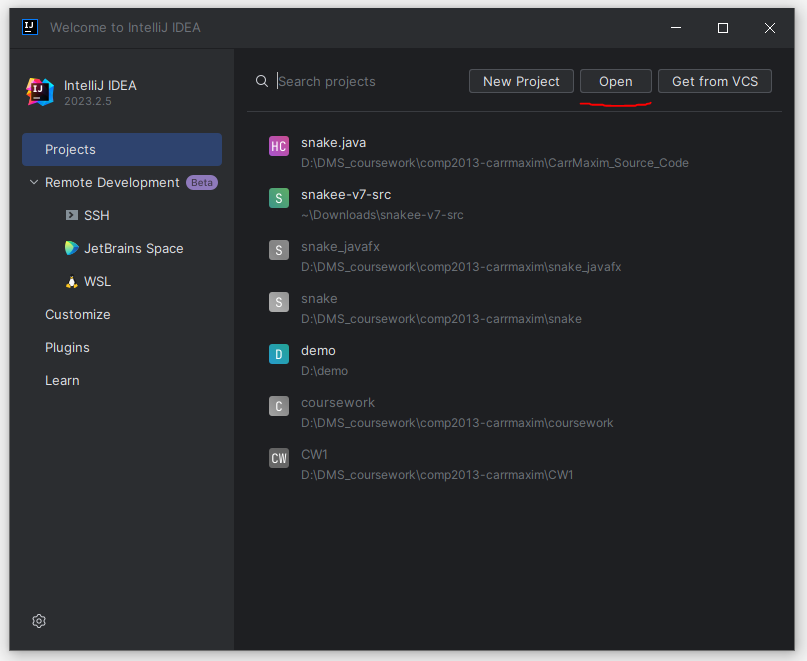
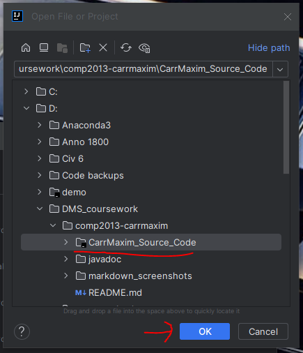
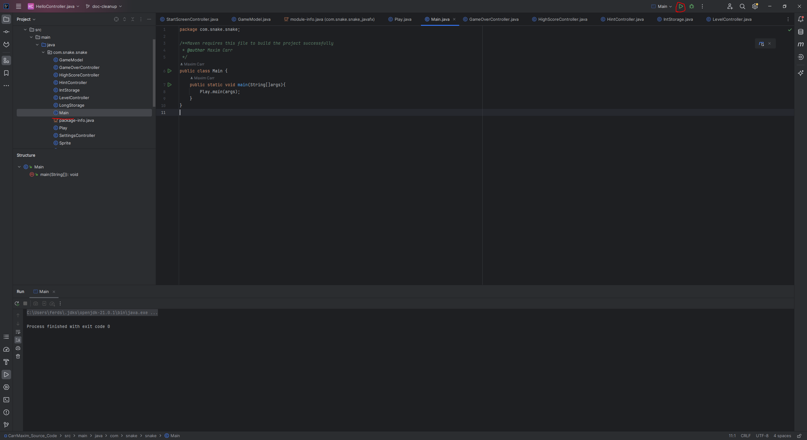

# Snake - Maxim Carr - JDK 21.0.1

## Description

An implementation of the game 'Snake' developed off of the original code base snakee-v7-src.
Project has been translated from Swing to JavaFX, new levels have been added and a high score system has been implemented. Control Snake with the arrow keys and see how high you score!
## How to Install and Run the program

1) Download either this whole repository or just the CarrMaxim_Source_Code folder
2) Open IntelliJ IDEA then on the Welcome to IntelliJ IDEA screen click 'open' or from inside the IDE go to File -> Open

3) Open the whole CarrMaxim_Source_Code folder

4) Navigate to Main.java within the project
5) Using Maven or IntelliJ's built-in builder, run the project.

## How to Play

1) You will be shown the Info & Hints page, if its the first time you've played
2) Click on Continue to Main Menu
3) Go to Settings if you want to disable sound, change to dark mode, or want a game length other than medium
4) Set your desired options and return to the main menu
5) Click on New Game
6) Press Start Game
7) Play the game until game over
8) Click the screen on the game over page
9) Enter your name, must be between 1 and 9 characters long
10) Press Save Score, if you scored high enough your name and score will be written to disk
11) If you beat the game, you can continue to play endless mode until you crash the snake
12) Return to the main menu.

## Credits

Images for Settings, High Scores, Levels 2 and 3, the Info & Hints page, and Wall sprites were taken from Google Images.

Colour invertion for dark/light mode Level backgrounds was performed at https://pinetools.com/invert-image-colors.
